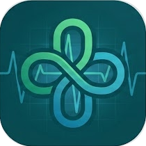
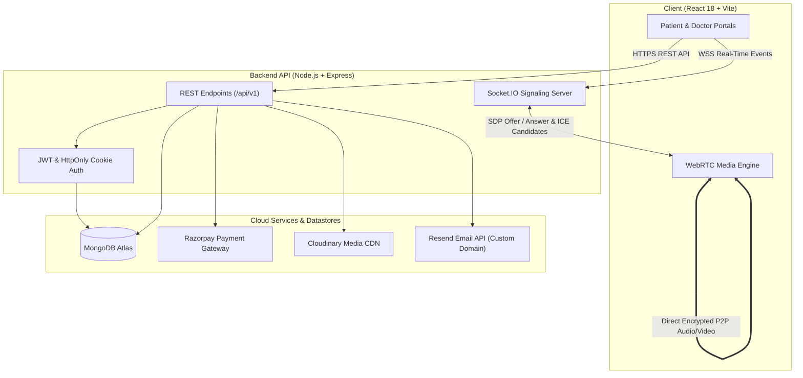

<div align="center">
  
  <h1>MediConnect</h1>
  <p><strong>Full-stack telehealth platform with role-based access control, WebRTC consultations, Razorpay payments, Cloudinary storage, and Resend transactional email.</strong></p>

  <p>
    <a href="https://react.dev/"></a>
    <a href="https://nodejs.org/"></a>
    <a href="https://expressjs.com/"></a>
    <a href="https://www.mongodb.com/"></a>
    <a href="https://webrtc.org/"></a>
    <a href="https://socket.io/"></a>
    <a href="https://resend.com/"></a>
    <a href="https://razorpay.com/"></a>
  </p>

 <p>
    <code>Features</code> &nbsp;•&nbsp;
    <code>Architecture</code> &nbsp;•&nbsp;
    <code>Tech Stack</code> &nbsp;•&nbsp;
    <code>Security</code> &nbsp;•&nbsp;
    <code>Quick Start</code> &nbsp;•&nbsp;
    <code>Deployment</code>
  </p>
</div>

---

## 🌟 Key Features

### 🩺 For Patients
* **Doctor Discovery & Filters**: Filter doctors dynamically by medical specialization, maximum fee, and years of clinical experience.
* **Smart Conflict-Free Slot Booking**: Dynamic calendar generating time slots strictly aligned with doctor availability schedules, backed by atomic database constraints.
* **Seamless Payment Integration**: Razorpay payment gateway integration with signature verification.
* **Encrypted 1-on-1 Video Visits**: Direct peer-to-peer browser video visits powered by WebRTC.
* **Digital Health Records**: Securely upload and access lab reports, past prescriptions.

### 👨‍⚕️ For Doctors
* **Practice & Schedule Management**: Configure clinical bio, consultation fee, and weekly recurring slot availability.
* **Appointment Management**: Track upcoming, completed, and canceled patient consultations with one-click room access.
* **Digital Prescription Studio**: Issue structured digital prescriptions with medicine dosages, intake timings, duration, and clinical notes.
* **In-Consultation Clinical Workspace**: Interactive WebRTC consultation room, patient history review, and instant prescription dispatch.

---

## 🏗️ System Architecture



---

## 🛡️ Security & Reliability

* **Secure Authentication**: JWT-based login using secure `HttpOnly` cookies and automatic token refresh.
* **Reliable Email Delivery**: Uses **Resend HTTP API** with a verified custom domain for transactional email delivery.
* **Double-Booking Prevention**: Database constraints ensure no slot can ever be booked twice by multiple users.
* **Role-Based Privacy**: Strict access controls so patients and doctors can only access their own records and visits.

---

## 💻 Tech Stack

| Domain | Technologies |
|---|---|
| **Frontend** | React 18, Vite |
| **Backend** | Node.js, Express, Socket.IO, Mongoose  |
| **Database** | MongoDB  |
| **Real-time Video** | WebRTC (`RTCPeerConnection`), Google STUN servers |
| **Payments** | Razorpay Orders API + Cryptographic Verification |
| **Cloud Storage** | Cloudinary & Multer Stream Storage |
| **Email API** | Resend HTTP API (Custom Domain Verified) |

---

## 🚀 Quick Start

### Prerequisites
- Node.js >= 18
- MongoDB Atlas account (or local MongoDB)
- Razorpay Test Account
- Cloudinary Account
- Resend Account (API Key)

### 1. Setup Backend
```bash
cd Backend
npm install
```

Create `Backend/.env`:
```env
PORT=4000
NODE_ENV=development
MONGODB_URI=your_mongodb_connection_string
CLIENT_URL=http://localhost:5173

ACCESS_TOKEN_SECRET=your_access_token_secret
ACCESS_TOKEN_EXPIRY=1d
REFRESH_TOKEN_SECRET=your_refresh_token_secret
REFRESH_TOKEN_EXPIRY=15d

CLOUD_NAME=your_cloudinary_name
API_KEY=your_cloudinary_key
API_SECRET=your_cloudinary_secret

RAZORPAY_KEY_ID=rzp_test_your_id
RAZORPAY_KEY_SECRET=your_razorpay_secret

RESEND_API_KEY=re_your_resend_api_key
MAIL_FROM="MediConnect <no-reply@mediconnecthealth.me>"
```

Run Backend:
```bash
npm run dev
```

### 2. Setup Frontend
```bash
cd mediconnect-frontend
npm install
npm run dev
```
Open `http://localhost:5173` in your browser.


## 📁 Project Structure

```text
MediConnect/
├── Backend/
│   ├── config/             # DB, Cloudinary, and Razorpay configs
│   ├── controllers/        # Auth, Appointment, Doctor, Patient, Records, Payment
│   ├── middleware/         # Auth verification, CSRF guards, Multer filters
│   ├── models/             # User, Doctor, Appointment, Prescription, etc.
│   ├── routes/             # Express route definitions
│   ├── socket/             # WebRTC signaling & room management
│   ├── utils/              # Resend email client & HTML templates
│   └── index.js            # Express app & Socket server entrypoint
│
├── mediconnect-frontend/
│   ├── src/
│   │   ├── components/     # UI components, Navbar, Cards, Modals
│   │   ├── lib/            # Axios API client, Auth context, Helpers
│   │   ├── pages/          # Landing, Booking, Appointments, ConsultationRoom, etc.
│   │   └── styles/         # Global design tokens and animations
│   └── vite.config.js
│
├── docker-compose.yml
└── README.md
```

---

## 📄 License
This project is open source and licensed under the MIT License.
